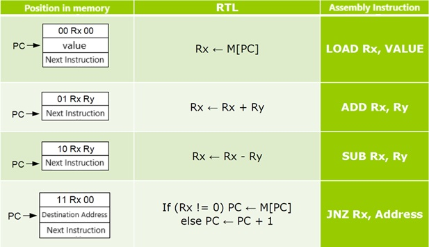

# Simple-Processor-VHDL

# Project Overview

In this project, two processors, **design1** and **design2**, have been developed:

- **design1**: Supports four operations: **ADD**, **SUB**, **JNZ**, and **LOAD**, and is intended for Section 1 of the project.
- **design2**: Includes the **MULT** operation in addition to the other four operations and is intended for Section 3 of the project.

Additionally:

- The assembly-to-binary conversion file is available in the project's folder for each processor, enabling direct programming of the `memory.vhd` file.
- Detailed explanations of the opcodes are provided in the assembler section.

## Description

#### Project Processor 6 OP-Code: LOAD, SUM, SUB, JNZ

#### LOAD: laods a data from a regester(there are 4 regesters from R0 to R4 available to load data from

#### SUM: For example

#### SUM R0 R1 means R0 = R0 + R1

#### SUB: For example

#### SUB R0 R1 means R0 = R0 - R1

#### JNZ : Jumps to the address in ROM when the Regester is not zero For example

#### JNZ Rx, Address means

#### if (Rx != 0) PC = M[PC]

#### else PC = PC + 1

The file has been designed in two configurations: Design 1 and Design 2, each corresponding to sections 1 and 3, respectively.

The files for converting assembly code to binary are also available in the Custom Processor folder and are capable of directly programming the respective memory file.

# 6-Bit Processor Project

In this project, a 6-bit processor designed in class will be implemented and programmed.

**Note:** This project will only be considered acceptable if a report is provided. The report should document the processor implementation and program execution, including appropriate images of the simulation output.

## Sections

### Section 1 (40% of the Project Grade)

- Implement the processor using **VHDL** or **Verilog**.
- Verify its functionality by executing the following assembly code, which adds the numbers 7 and 4:

````assembly
LOAD R0, 7
LOAD R1, 4
ADD R0, R1


Section 2 (20% of the Project Grade)
Since the processor lacks a multiplication instruction, implement multiplication using addition in software.

Verify its functionality with an example. For instance, write an assembly code that calculates the product of 8 and 6.

Section 3 (40% of the Project Grade)
Add a multiplication instruction to the instruction set with minimal hardware overhead.

Verify its functionality by writing an assembly code that calculates the product of 8 and 6.

This step will require modifications to both the hardware and the instruction set.

Bonus (1 Point)
Implement an assembler to convert assembly code into binary code using high-level programming languages, such as Java or Python.

## Processor Schematic


# Processor Instructions

This processor supports four instructions: **LOAD**, **ADD**, **SUB**, and **JNZ**, with the following operation codes (Op Codes):

| Instruction | Op Code |
|-------------|---------|
| LOAD        | 00      |
| ADD         | 01      |
| SUB         | 10      |
| JNZ         | 11      |

# Instruction Format
The processor uses the following instruction format:
Op Code | R_SRC | R_DST



#Control Unit ASM Chart


#Results of a sample sum operation
##Simulations Output


#Results of simulated multiplications using sum instructions

```assembly
LOAD R0, 0
LOAD R1, 1
LOAD R2, 8
LOAD R3, 6
ADD R0, R2
SUB R3, R1
JNZ R3, 8
HLT


```vhdl created from asembler code
ROM(0)  <= "000001";
ROM(1)  <= "000000";
ROM(2)  <= "000101";
ROM(3)  <= "000001";
ROM(4)  <= "001001";
ROM(5)  <= "001000";
ROM(6)  <= "001101";
ROM(7)  <= "000110";
ROM(8)  <= "010010";
ROM(9)  <= "101101";
ROM(10) <= "111100";
ROM(11) <= "001000";
ROM(12) <= "000000";

##Simulations Output


# Results of hardware multiplications unit

## Assembly Code
```assembly
LOAD R0, 6
LOAD R1, 8
MULT R0, R1
HLT

## ROM Initialization Code
```vhdl
ROM(0)  <= "000001";
ROM(1)  <= "000110";
ROM(2)  <= "000101";
ROM(3)  <= "001000";
ROM(4)  <= "110001";
ROM(5)  <= "000000";


````
